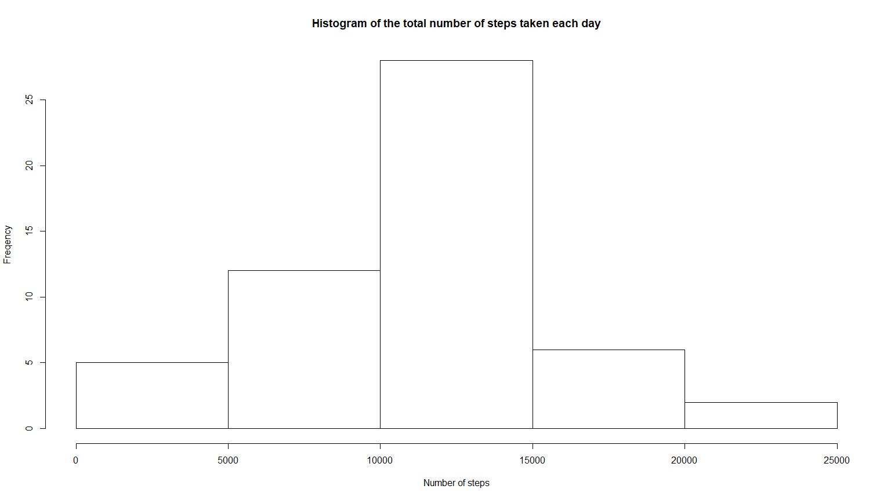
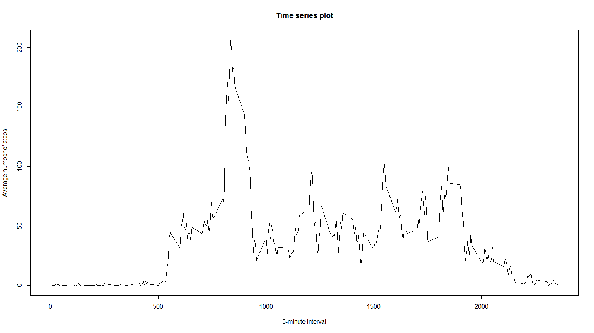
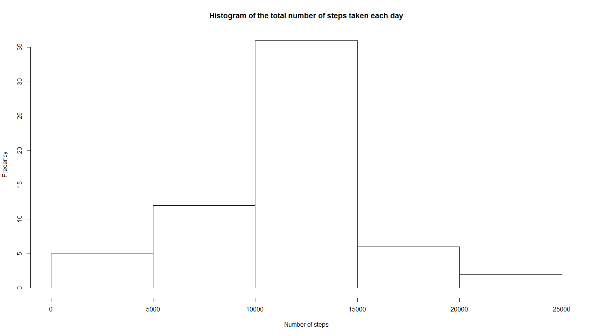
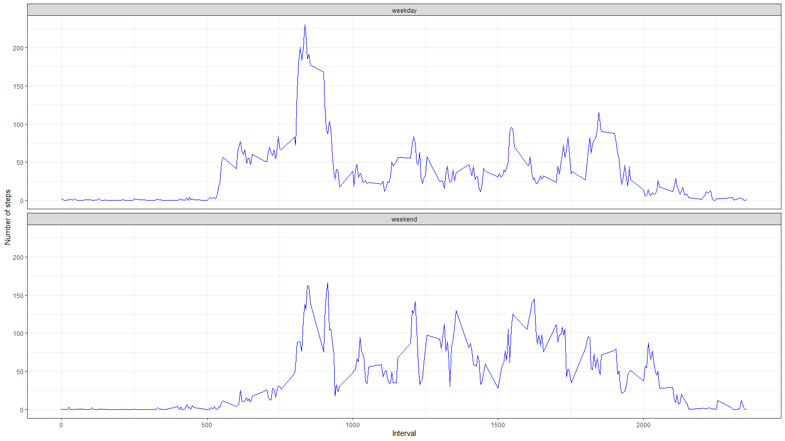

## Loading and preprocessing the data
### Note:  'dplyr' and 'ggplot2' packages are required.  

```r
library(dplyr)
```

```
## 
## Attaching package: 'dplyr'
```

```
## The following objects are masked from 'package:stats':
## 
##     filter, lag
```

```
## The following objects are masked from 'package:base':
## 
##     intersect, setdiff, setequal, union
```

```r
library(ggplot2)
```


The next code preprocesses the data.  
h2 represents "not NA values" in steps  


```r
ht <- read.csv("activity.csv", stringsAsFactors = FALSE)
  # Structure of ht$date shows a character variable, so change it using as.Date function
ht$date <- as.Date(ht$date)
  # remove Missing values
h2 <- ht[!is.na(ht[,1]),]
```
# A
## What is mean total number of steps taken per day?

### Problem A1
Firstly, the next code calculates "Total number of steps taken per day"  
The second column of h4 represents "Total number of steps taken per day"  

```r
h3 <- group_by(h2,date)
h4 <- summarise(h3,Total_number_of_steps = sum(steps))
print(h4)
```

```
## # A tibble: 53 x 2
##    date       Total_number_of_steps
##    <date>                     <int>
##  1 2012-10-02                   126
##  2 2012-10-03                 11352
##  3 2012-10-04                 12116
##  4 2012-10-05                 13294
##  5 2012-10-06                 15420
##  6 2012-10-07                 11015
##  7 2012-10-09                 12811
##  8 2012-10-10                  9900
##  9 2012-10-11                 10304
## 10 2012-10-12                 17382
## # ... with 43 more rows
```


### Problem A2
Secondly, the next code make a "histogram" of the total number of steps taken each day.

```r
hist(h4$Total_number_of_steps, xlab = "Number of steps", ylab= "Freqency",
     main="Histogram of the total number of steps taken each day")
```

<!-- -->

Lastly, we can calculate mean and median of total number of steps taken each day,  
 by using mean and median functions

```r
Mean1 <- mean(h4$Total_number_of_steps)
names(Mean1) <- "Mean"
Median1 <- median(h4$Total_number_of_steps)
names(Median1) <- "Median"
print(c(Mean1,Median1))
```

```
##     Mean   Median 
## 10766.19 10765.00
```


# B
## What is the average daily activity pattern?


### Problem B1.
We can process h2, which are grouped by interval,  
  and average of steps is saved in the column 'avg' of hB  

```r
hB <- group_by(h2, interval) %>% summarise(avg = mean(steps))
plot(hB$avg ~ hB$interval, type="l", xlab="5-minute interval",
ylab = "Average number of steps", main = "Time series plot")
```

<!-- -->

### Problem B2.
  We get the maximum number of steps by 'max' function, and  
  we get the interval by 'which' function.  
  The interval 835 represents the peak in the plot.

```r
max(hB$avg)
```

```
## [1] 206.1698
```

```r
hB$interval[which(hB$avg== max(hB$avg))]
```

```
## [1] 835
```


# C
## Imputing missing values

### Problem C1. Number of missing values
We save the number of missing values ("NA"s) in the three columns   
 to the values sum1, sum2, and sum3
The three values are merged in the vector 'NAs'

```r
sum1<- sum(is.na(ht[,1]))
sum2<- sum(is.na(ht[,2]))
sum3<- sum(is.na(ht[,3]))
NAs <- c(sum1,sum2,sum3); names(NAs) <- colnames(ht)
NAs
```

```
##    steps     date interval 
##     2304        0        0
```
### Problem C2, C3. Filling all of the missing values
We will take original data 'ht' and save it to 'hC'.  
And then we will take data 'hB',  
which contains average steps per interval, in problem B.  
'l1' takes raws with NA values in steps in the data hC.  
C1 contains values of 'interval' column in the data hC.  
Average value in hB, with same interval in C1, are returned to J.  
First column of hC is steps, so the last line eventually takes mean of the interval ('J').

```r
hC <- ht
l1<- is.na(hC$steps)
C1 <- hC[l1,3]
J<- integer(); for (i in 1:length(C1)) {J <-c(J,hB$avg[hB$interval == C1[i]])}
hC[l1,1]<-J
```

We will see the diffrence of original value and revised value in first 10 raws

```r
#First three columns from original data
# Fourth column: revised value in data hC
# Fifth column: Average value in problem B
cbind(ht[1:10,],hC[1:10,1], hB[1:10,2])
```

```
##    steps       date interval hC[1:10, 1]       avg
## 1     NA 2012-10-01        0   1.7169811 1.7169811
## 2     NA 2012-10-01        5   0.3396226 0.3396226
## 3     NA 2012-10-01       10   0.1320755 0.1320755
## 4     NA 2012-10-01       15   0.1509434 0.1509434
## 5     NA 2012-10-01       20   0.0754717 0.0754717
## 6     NA 2012-10-01       25   2.0943396 2.0943396
## 7     NA 2012-10-01       30   0.5283019 0.5283019
## 8     NA 2012-10-01       35   0.8679245 0.8679245
## 9     NA 2012-10-01       40   0.0000000 0.0000000
## 10    NA 2012-10-01       45   1.4716981 1.4716981
```

### Problem C4. Histogram, mean and total of revised dataset
We will draw histogram as problem A

```r
hC4 <- group_by(hC,date) %>% summarise(Total_number_of_steps = sum(steps))
hist(hC4$Total_number_of_steps, xlab = "Number of steps", ylab= "Freqency",
     main="Histogram of the total number of steps taken each day")
```

<!-- -->

We will see mean and median as problem A

```r
Mean2 <- mean(hC4$Total_number_of_steps)
names(Mean2) <- "Mean"
Median2 <- median(hC4$Total_number_of_steps)
names(Median2) <- "Median"
print(c(Mean2,Median2))
```

```
##     Mean   Median 
## 10766.19 10766.19
```


# D
## Are there differences in activity patterns between weekdays and weekends?


### Problem D1. New dataset 0

We will change characteristics of weekdays in Englihsh

```r
Sys.setlocale("LC_TIME","C")
```

```
## [1] "C"
```
New dataset is named as "hD", all values are set to be "weekday" as default

```r
hD<- cbind(hC, WW = "weekday")
```
"WW" column in "hD" are revised as character,  
 and raws, whose weekdays of date is "Saturday" or "Sunday",  
  are set to be as "weekend"

```r
hD$WW <- as.character(hD$WW)
hD$WW[weekdays(hD$date) %in% c("Saturday", "Sunday")] <- "weekend"
```

### Problem D2. Plot
Process data with similar codes in problem B, plus "WW" column

```r
hD2 <- group_by(hD, WW, interval) %>% summarise(avg = mean(steps))
```
Using data set 'hD2',  
we see the lines of weekend and weekday


```r
ggplot(hD2,aes(interval,avg,group=WW)) +
  geom_line(colour="blue")+facet_wrap(~WW, ncol=1) +
    xlab("Interval")+ylab("Number of steps")+theme_bw()
```

<!-- -->
